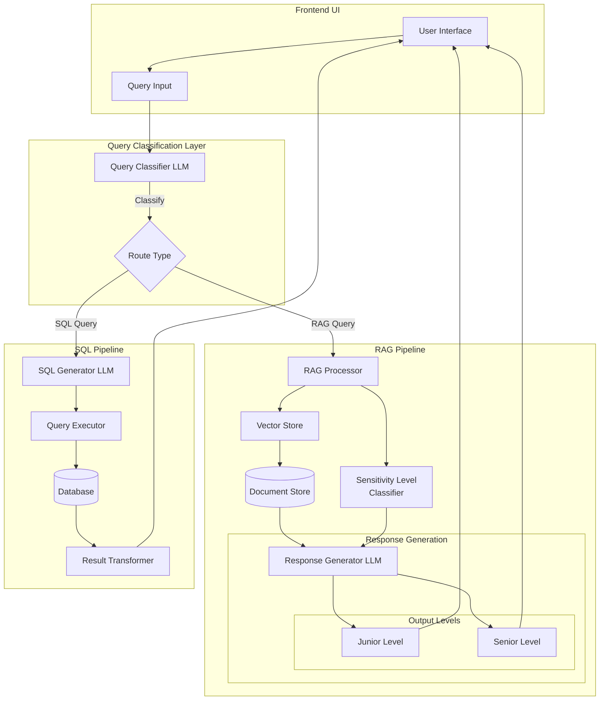

# Intelligent Query Classification and Routing System

## 🌟 Overview
An advanced query processing system that intelligently routes and processes user queries through RAG (Retrieval-Augmented Generation) or SQL pipelines based on query classification. The system features sensitivity-level awareness and bi-directional information flow for enhanced accuracy and user experience.

## 📋 Table of Contents
- [Features](#features)
- [System Architecture](#system-architecture)
- [Installation](#installation)
- [Configuration](#configuration)
- [Usage](#usage)
- [Contributing](#contributing)
- [License](#license)

## ✨ Features

### Core Capabilities
- 🤖 Intelligent query classification using LLM
- 📚 RAG pipeline for document-based queries
- 💾 SQL pipeline for database queries
- 🔄 Bi-directional information flow
- 🎯 Multi-level sensitivity response generation
- 🔍 Vector-based semantic search
- 📊 Dynamic response formatting

### Key Benefits
- Automatic query routing
- Context-aware responses
- Scalable architecture
- Enhanced accuracy through feedback loops
- Secure data handling

## 🏗 System Architecture

### System Flow Diagram

### Architecture Components

1. **Frontend Layer**
   - User Interface for query input
   - Response display with appropriate formatting
   - User feedback collection

2. **Query Classification Layer**
   - LLM-based query analyzer
   - Route determination (RAG vs SQL)
   - Context preservation

3. **RAG Pipeline**
   - Document retrieval and processing
   - Vector store integration
   - Context-aware response generation
   - Multi-level sensitivity classification

4. **SQL Pipeline**
   - Natural language to SQL conversion
   - Database query execution
   - Result transformation
   - Response formatting

## 🚀 Installation

### Prerequisites
- Python >= 3.9
- Vector Database (e.g. Qdrant)
- SQL Database (e.g. sqlite3)

### Setup Steps

1. Clone the repository
2. Install dependencies
3. Configure environment variables
4. Initialize databases
5. Start the service

## ⚙️ Configuration

### Required Environment Setup
- Ollama Local Setup
- Vector Store Configuration
- Database Configuration

### Sensitivity Levels
- Junior: Basic information, simplified terms
- Senior: Comprehensive information, advanced terminology

## 📝 Usage

### Basic Operation
1. Submit query through interface
2. System classifies query type
3. Query routed to appropriate pipeline
4. Response generated based on sensitivity level
5. Results displayed to user

### Advanced Features
- Custom pipeline integration
- Feedback mechanism
- Context preservation
- Query history tracking
- Response customization

## 🤝 Contributing

We welcome contributions! Please follow these steps:
1. Fork the repository
2. Create your feature branch
3. Submit pull request

### Development Guidelines
- Follow coding standards
- Add appropriate documentation
- Include test cases
- Update README when needed

## 📄 License

This project is licensed under the MIT License - see the [LICENSE](LICENSE) file for details.

## 🙏 Acknowledgments
- LLM integration powered by Meta
- Vector store capabilities provided by Qdrant
- Built with Python
- Thanks to all contributors!

## 📞 Support

For support:
1. Check documentation
2. Search existing issues
3. Create new issue if needed

---

## 📊 Project Status

Current Version: 1.0.0
Status: Active Development

---
Built with ❤️ by [Team Resilience]